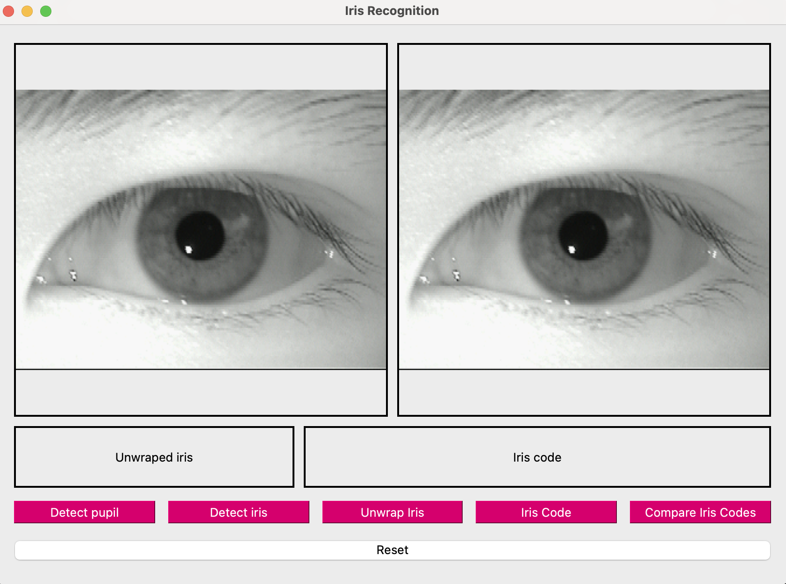

# README: Aplikacja do Detekcji i Analizy Tęczówki oraz Źrenicy

Aplikacja umożliwia podstawowe funkcje detekcji źrenicy i tęczówki oka, oferując narzędzia do ich analizy. Kluczowe funkcje aplikacji:

## Funkcje:

1. **Detekcja Źrenicy i Tęczówki**  
   Aplikacja umożliwia identyfikację i wykrywanie źrenicy oraz tęczówki w obrazie oka, co pozwala na ich szczegółową analizę.

2. **Rozwój Tęczówki**  
   Funkcja umożliwia rozszerzanie oraz powiększanie obszaru tęczówki w celu lepszej analizy i wizualizacji.

3. **Generowanie Kodów Tęczówek**  
   Aplikacja umożliwia generowanie unikalnych kodów tęczówek na podstawie analizy obrazu, co może być wykorzystane w dalszym przetwarzaniu lub porównaniu.

4. **Porównanie Tęczówek Między Oczami**  
   Użytkownicy mogą porównać tęczówki z dwóch różnych oczu, co pozwala na ich dokładne porównanie pod względem struktury, kształtu czy rozmiaru.

## GUI (Graficzny Interfejs Użytkownika)

Aplikacja posiada prosty i intuicyjny **graficzny interfejs użytkownika (GUI)**, który umożliwia:

- **Wczytywanie obrazów oczu** – Użytkownicy mogą łatwo załadować obrazy tęczówek do aplikacji.
- **Interaktywne narzędzia detekcji** – Interfejs umożliwia użytkownikowi interakcję z algorytmami detekcji w czasie rzeczywistym, ułatwiając analizę obrazów.
- **Generowanie wyników** – Wygodne wyświetlanie wyników analizy, w tym porównanie dwóch tęczówek, wygenerowane kody oraz wykresy.
- **Obsługa plików graficznych** – Możliwość zapisywania wyników analizy oraz eksportu generowanych kodów tęczówek w formacie pliku.

## Użyty Zestaw Danych

Aplikacja wykorzystuje zestaw danych **MMU Iris Dataset**, dostępny na platformie [Kaggle](https://www.kaggle.com/datasets/naureenmohammad/mmu-iris-dataset), do analizy tęczówek i źrenic. Zestaw danych zawiera obrazy tęczówek, które zostały wykorzystane do treningu i testowania algorytmów wykrywania oraz porównywania tęczówek.

**Źródło:**  
[MMU Iris Dataset](https://www.kaggle.com/datasets/naureenmohammad/mmu-iris-dataset)
